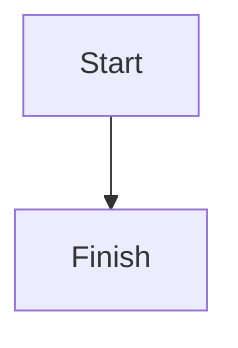
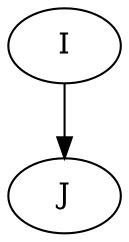
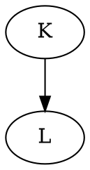
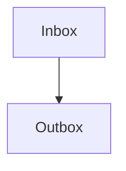
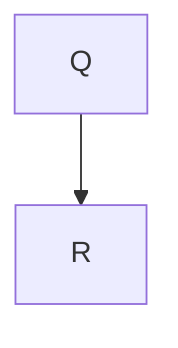

# Every fence shape

Backtick mermaid, the common case.



Tilde mermaid.

~~~mermaid
flowchart TD
  C[Load] --> D[Save]
~~~

Azure DevOps mermaid, with and without the space.

::: mermaid
flowchart TD
  E[Read] --> F[Write]
:::

:::mermaid
flowchart TD
  G[Open] --> H[Close]
:::

Graphviz, under both names.





A capitalized language, and a trailing info string.

```Mermaid
flowchart TD
  M[Ask] --> N[Tell]
```



A code sample is a fence but not a diagram.

```python
print("hello")
```

~~~
plain tilde block
~~~

A four-backtick fence holds a mermaid fence as text, not as a diagram.

````markdown

````

An admonition is prose, not a fence.

::: note
This paragraph is prose inside an admonition.
:::

- A list item with a fence directly beneath it:
  ```mermaid
  flowchart TD
    S[Left] --> T[Right]
  ```

The last fence is never closed, so it runs to the end of the document.

```mermaid
flowchart TD
  U[Tail] --> V[End]
