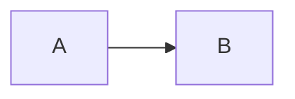
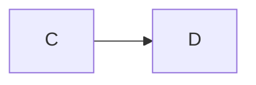
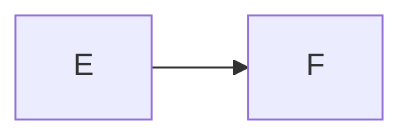
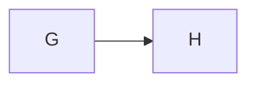

# Figure labels

**How a request reaches the database**

*A request passes through the API to the database.*

__A title in underscores, two blank lines above the fence__

_A caption in underscores, two blank lines below._

This paragraph ends in bold, which is not a title:
**not a title**

The caption slot holds prose, *partly italic*, which is not a caption.

* a list item is not a caption
