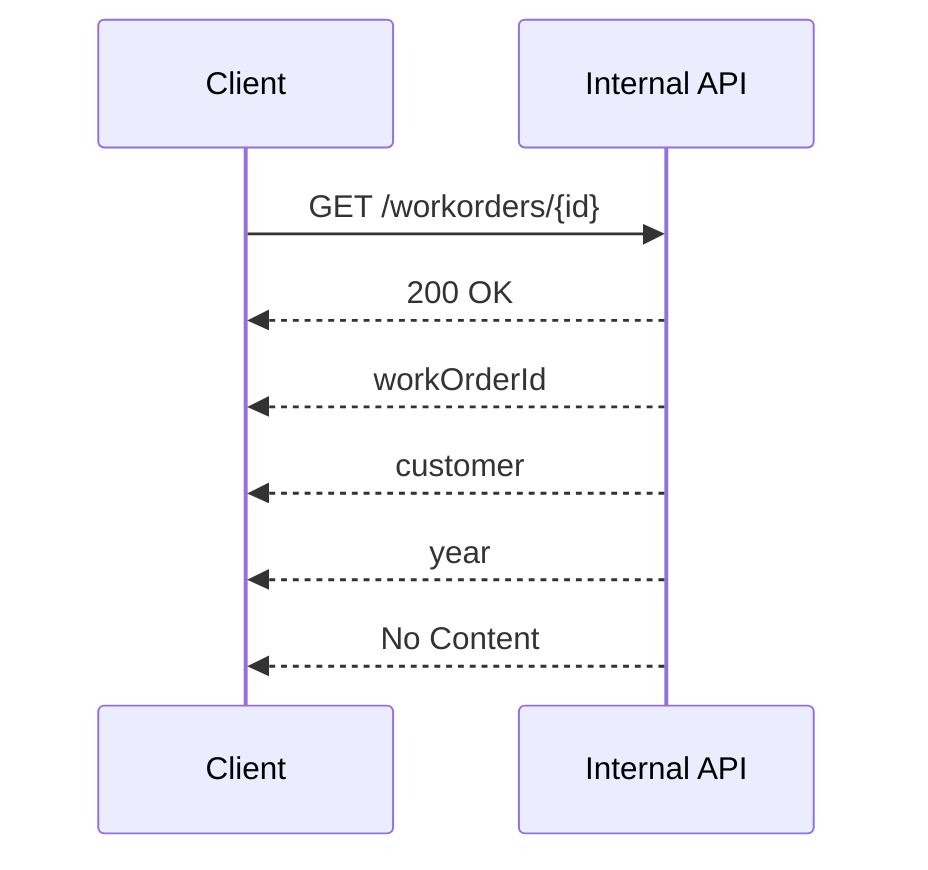

# Work order lookup



The lookup reads `/api/v2/workorders/{id}` and returns the order with its `Installer_ID`, its `woDetail.Customer_ID` and the
insurer name, for example Contoso.Insurance. A Lowe's order is looked up the same way.

Response example:

```
1985
```
