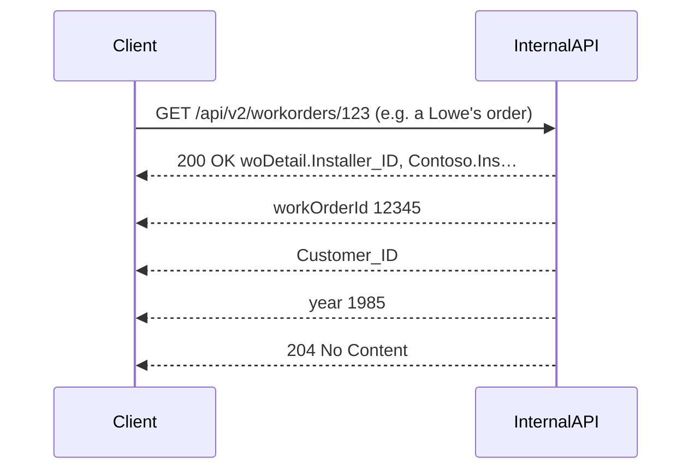

# Work order lookup

```mermaid
sequenceDiagram
  participant C as Client
  participant I as InternalAPI
  C->>I: GET /api/v2/workorders/123 (e.g. a Lowe's order)
  I-->>C: 200 OK woDetail.Installer_ID, Contoso.Ins…
  I-->>C: workOrderId 12345
  I-->>C: Customer_ID
  I-->>C: year 1985
  I-->>C: 204 No Content
```
