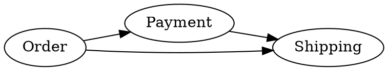

# Order flow

The same graph, escalated to Graphviz as the skill prescribes for a real graph.

**How an order reaches shipping**

```dot
digraph {
  rankdir=LR;
  order [label="Order"];
  pay [label="Payment"];
  ship [label="Shipping"];
  order -> pay;
  pay -> ship;
  order -> ship;
}
```

*An order ships after payment, or directly.*
