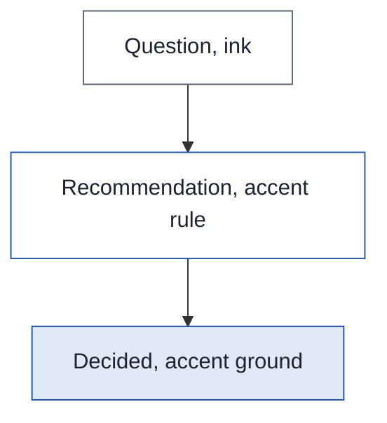

# Art director's pass — 2026-09-20

Brief: Edward's eight notes on the three maestro editions (coordinator-loop, execution-broker,
podium-promises), read on paper. This is a proposal; nothing here is implemented. Every device
below re-containers or restyles text the source already has; none adds, moves or rewrites a word.

Judged from renders: all three editions printed to PDF through the repo renderer and read page by
page; figure 21 re-rendered under two theme settings to confirm the cause.

## How it would look

- An open question reads as three things, not one: the question in ink, the **recommendation**
  set off under an accent hairline with its label in small caps, the **decision** (where one
  exists) on a tinted ground — the same ground the verdict panel already uses.
- Tables have a faint grey stripe on every second row, and the head row is unchanged.
- Named boxes (the entity cards, the actor cards) sit on a pale ground with a short dark rule at
  the head instead of a wire border.
- A pair of bold-lead paragraphs gets the rung treatment a run of three gets today, and a
  `Q1.`-style heading carries its number as a badge, so the review-round sections gain entry
  points every few inches.
- Sequence diagrams: each participant keeps one colour across the whole edition; arrows and
  message text stay ink.
- Cluster titles in flowcharts sit above their nodes, never on them.
- The podium dashboard's prose measure widens from 34em to 38em; the right margin stops reading
  as a hole.

## 1. Open questions: question, recommendation, decision

**Diagnosis.** execution-broker §12 (p. 34) is already a fielded ladder: the builder found the
shared leads `Recommendation:` and `Decided:` and set them as small-cap labels. The labels are
7.5pt ink-soft, inline, with no rule or ground, so at reading distance the rung is still one grey
block with two faint words in it. coordinator-loop §14 (pp. 37–38) gets nothing at all: its items
share only one lead (`Recommendation:`), and `sharedLeads` needs two, so seventeen question-and-
answer items print as seventeen plain rungs and the reader hunts for "Recommendation" by eye.
Neither section fires the verdict panel, which only reads a paragraph that *opens* with the word.

A second defect on p. 34: `DECIDED: as recommended.**` — the fielded splitter strips the `**`
before a lead but not the `**` that closes the last field, so a stray `**` prints on every
`**Decided: …**` field. `splitFields` in build-magazine.mjs: the last field's text needs the same
`.replace(/\*\*\s*$/, '')` the earlier fields get.

**Device.** One rung, three containers. The question is the rung's own paragraph. The
recommendation is an *answer block*: a 2px accent rule at the left, label in accent small caps,
no ground. The decision is a *decision block*: the verdict panel's ground (`--accent-bg`), label
in accent, so the eye finds what was actually decided the way it finds a verdict today. A
`Pending.` lead is a decision block with no ground — it is not an answer yet.



**Builder.** Two changes in the ladder path.

- `sharedLeads` accepts a single shared lead when that lead is in `VERDICT_LEXICON` (a
  recommendation alone is enough to split on). That makes coordinator-loop §14 a fielded ladder
  with one field per rung.
- `renderFields` marks a field whose lead matches the lexicon: `Recommendation|Verdict|Answer` →
  `<div class="answer">`, `Decided|Decision` → `<div class="decision">`, `Pending` →
  `<div class="decision pending">`. Everything else stays a plain field. Text inside is untouched;
  only the wrapper changes.
- The same lexicon test extends to a paragraph that carries `Recommendation:` at a sentence
  boundary rather than at its opening (the coordinator-loop shape): `splitFields` already finds a
  lead after `[.!?:]\s`, so once the single-lead rule is in, no new recogniser is needed.

**CSS.**

```css
.fields .answer   { margin: 4pt 0 0; padding: 2pt 0 2pt 10px; border-left: 2px solid var(--accent); }
.fields .answer dt, .fields .decision dt { color: var(--accent); }
.fields .decision { margin: 4pt 0 0; padding: 4pt 10px; background: var(--accent-bg); border-radius: 0 3px 3px 0; }
.fields .decision.pending { background: none; padding-left: 10px; border-left: 2px solid var(--line); }
.fields .decision dt::after { content: ""; }
```

**Meaning.** Accent already means "the answer" (verdict label, verdict ground). This extends that
one meaning to the places the answer lives inside a list; it does not paint a new kind of thing.
Count: one accent rule per question, one tinted block per decided question — on p. 37, seventeen
rules and no tints; on p. 34, six rules and five tints. That is the density of a well-marked
Q&A page, not the 178-element wash.

**Print and fidelity.** Ground and rule survive `print-color-adjust: exact`, which is already on
`body`. The `.fields > div` blocks already carry `break-inside: avoid` through `.rung`; a long
rung (`rung.long`) may break between fields, which is the right place. The fidelity check
collapses whitespace, so a paragraph split into two `<div>`s at "Recommendation:" still matches
its source line.

## 2. Breaking up walls of text

**Diagnosis.** The walls left are of two shapes. (a) Review-round sections (execution-broker
§13 pp. 35–43, coordinator-loop §13) where each `### Q1.` is followed by three to six paragraphs
that open with bold leads in pairs — `**Performance: no.**`, `**Reliability: …**` — which the
ladder ignores because it needs a run of three. (b) Design sections with long plain paragraphs
and a `<code>` identifier every line, where the only relief is the pull-quote every 320 words.

**What the craft has, and what the markdown already signals.**

| Device | Signal in the source | Verdict |
| --- | --- | --- |
| Rung for a pair of bold leads | two consecutive bold-lead paragraphs | **Do.** Lower the ladder threshold from 3 to 2 when both leads are ≤ 5 words. The 3 was caution against false positives; a pair of short leads is the same shape. |
| Question badge on `Q1.` headings | `### Q1. …`, `### Q12. …` | **Do.** A recogniser on `h3` text `^Q(\d+)\.\s` renders `<span class="q-badge">Q1.</span>` before the rest — the same badge the numbered rung uses (`--accent-bg`, ink). The number is the author's, kept. |
| Run-in `h4` | an `####` heading followed by one short paragraph | **Do.** Set the h4 inline with its paragraph's first line (`h4 + p` with `display: inline` on the h4 and a hanging rule) — a magazine sub-head. The words are unchanged; only the break after the head disappears. |
| Key-term emphasis | the author's `**…**` | **Already used.** The fix here is not more bold but more entry points around it. |
| Small caps for code identifiers | backtick spans | **Reject.** Mono already distinguishes them; small caps would fight the field labels, which own that register. |
| Hairline between logical parts of one paragraph | `Recommendation:` at a sentence start | **Do** — this is note 1. |
| Numbered step blocks | `Step n` leads | **Already used** (numbered rungs). |
| Marginal notes / sidebars | none | **Reject.** A 3.65in column has no margin to note in; a sidebar needs text nobody wrote. |
| "At a glance" boxes | none | **Reject.** Summary text would have to be written; the deck and the verdict panel are the at-a-glance devices this edition may have. |
| First-line indent, no paragraph space | — | **Reject.** It makes a column denser, which is the opposite of the complaint. |
| Paragraph-opening bold as a run-in | a lone bold-lead paragraph | **Do, lightly.** A single bold-lead paragraph outside a ladder gets `p.lead` — the lead in sans bold, as `.rung-label` is — so the eye catches it. No rule, no ground; it is one paragraph, not a rung. |

**Builder.** In `structure()`: the ladder loop's `units.length >= 3` becomes `>= 2` when every
unit's label is ≤ 5 words; the `h` case tests `^Q\d+\.` and wraps the badge; the `p` case, when
`lead` is set and no ladder formed, emits `<p class="lead">` with the label in `<span class="runin-label">`.
In the `h` case, an h4 followed by a paragraph under 80 words gets `class="runin-head"`.

**CSS.**

```css
p.lead .runin-label { font-family: var(--sans); font-size: 9.5pt; }
.q-badge { display: inline-block; margin-right: 6px; padding: 0 5px; font-size: 9pt; line-height: 13pt;
           color: var(--ink); background: var(--accent-bg); border-radius: 2px; }
h4.runin-head { display: inline; margin: 0 0.5em 0 0; }
h4.runin-head + p { display: inline; }
h4.runin-head + p::after { content: ""; display: block; margin-bottom: calc(var(--u) * 0.5); }
```

**Meaning.** None of these touches the accent except the Q badge, which reuses the numbered
rung's badge (ink on accent-bg — a numeral, which the accent already marks). Rung rules stay
ink-soft: "a named unit within a set".

**Print and fidelity.** All wrappers; nothing reorders. The run-in h4 keeps `break-after: avoid`
by being inline with its paragraph. The ladder-of-two carries the existing `rung`/`rung.long`
break rules.

## 3. Tables: alternating rows

**Diagnosis.** Body rows are separated by a 1px `--line-soft` rule only; on a six-row entity
table (p. 6) with three-line cells, the eye loses the row on the way across. The head row on
`--accent-bg` is the table's one colour and gives it an identity; leave it.

**CSS.**

```css
tbody tr:nth-child(even) td, tbody tr:nth-child(even) th { background: var(--tint); }
tbody tr:last-child td { border-bottom: 1.5px solid var(--ink-soft); }
```

**Meaning.** `--tint` (#f6f7f9) is the neutral ground already used for code blocks — it carries
no meaning, which is what a stripe should carry. The closing rule steps up from `--line` to
`--ink-soft` so the table's foot reads as a foot; still no accent.

**Print.** #f6f7f9 is faint on a mono laser but visible; if it drops out on his printer, step to
#f2f4f7. `print-color-adjust: exact` already covers it. Repeated heads (`thead` as
`table-header-group`) do not disturb `nth-child` because it counts inside `tbody`.

## 4. Boxes: cards want a ground

**Diagnosis.** The card grid (execution-broker §2.1 actors, p. 8; the use-case cards) is a wire
border on white — exactly the same weight as the column rule and the table rules around it, so a
card does not read as a thing, only as a fence. The record card in `.records` already uses a
2px ink-soft left rule and reads better.

**Device.** Drop the border; give the card `--tint` as a ground and a 2px `--ink-soft` rule at
the head. This is the record card's rule turned ninety degrees, so grid cards and stacked
records share one vocabulary.

**CSS.**

```css
.card { border: 0; border-top: 2px solid var(--ink-soft); border-radius: 0 0 3px 3px; background: var(--tint); }
.card code { background: var(--paper); }
```

**Meaning.** The ink-soft rule already marks "a named unit" on rungs, run-ins and records.
Grey ground, no hue: a card is a container, not a status. Rejected: a per-card hue or an accent
title — that is the 96→178 mistake by another door.

**Print.** Same ground as code blocks, already proven on paper. `break-inside: avoid` unchanged.

## 5. The dashboard's right margin

**Diagnosis.** `.flow > p { max-width: 34em }` was set for Georgia; at Segoe 10pt, 34em is
4.6in and 74 characters, and on a page of running prose (podium p. 3, p. 5) the remaining 2.9in
is white with nothing in it. In the landscape dashboard the same rule is already 40em.

**CSS.** `.sans-body .flow > p, .sans-body .flow > ul, .sans-body .flow > ol,
.sans-body .flow > blockquote, .sans-body .flow > .deflist, .sans-body .flow > .runin,
.sans-body .flow > .ladder, .sans-body .flow > .deck, .sans-body .flow > .verdict { max-width: 38em; }`
— 5.3in, about 82 characters, the "about 80" the stylesheet's own comment promises. The
remaining 2.2in reads as a deliberate margin against full-width exhibits, not a hole.

**Long term.** A run of prose over about 250 words in a single-column edition becomes a local
two-column section — `.columns.local` already exists for text beside a tall plate, and `layout()`
already knows how to gather blocks into one. That is the real fix for a dashboard that turns
out to be mostly prose; the 38em is the hour's fix.

## 6. More colour in the sequence diagrams

**Diagnosis.** Every participant is the same blue tint with the same blue border (theme
`actorBkg`/`actorBorder`); the only other colours on a sequence plate are the amber note boxes.
Mermaid's theme has one actor colour, so the theme cannot do this alone.

**Device.** The builder post-processes each sequence SVG: every `<rect class="actor" name="X">`
gets a fill and stroke chosen from a fixed palette by the participant's name, and the same name
gets the same colour on every plate in the edition. Lifelines, arrows and message text stay ink.
Palette, in order of first appearance: blue `#e9eff9/#2456a6`, green `#e9f5ee/#1f7a4d`,
violet `#f1e9f7/#6b3fa0`, amber `#faf1de/#b3781c`, orange `#fbeee1/#c1631f`, then ink-soft
`#eceff3/#5b6672` for a seventh and beyond. Notes stay amber — so amber is skipped for actors
until the fifth participant, and a note is never the same colour as the actor it annotates on a
four-actor plate.

**Builder.** In `renderFigure`, after `fitSvg`, for a source that starts `sequenceDiagram`:
collect `name="…"` from `rect.actor` in order, look each up in an edition-wide `Map` on `ctx`
(`ctx.actorHues`), assign the next palette slot on first sight, and append
`<style>#id rect.actor[name="X"]{fill:…;stroke:…}</style>` inside the SVG. The attribute
selector outranks mermaid's own `#id .actor` rule. Every SVG must first get a unique `id`
(they all ship as `my-svg` today), which is a one-line `replace`.

**Meaning.** Colour = identity of a participant, held across the edition: `ExecutionBroker` is
green on figure 14 and green on figure 29. This is the first meaning colour has carried in a
sequence plate; it does not touch the accent or the pill hues (a green actor is not "passed" —
it is a box with a name in it, the reader will not confuse the two, and the palette gives
green to the second actor not the first so the broker's edition-wide colour is not the accent).

**Theme.** Also `sequenceNumberColor` stays white on ink; the numbered circles are already the
plate's darkest mark and read well.

## 7. Figure 21's overlap

**Diagnosis, measured.** Figures 21 and 23 (execution-broker pp. 24–25) print their cluster
titles — "Hosted lanes, provider", "Coordinator box, local" — on top of the first node inside the
cluster, and edge labels ("Build, artifact", "Corpus at merge") on top of each other. The cause
is the theme, not the fit: `flowchart.padding: 3` was tightened so plates print larger, and a
cluster with `direction LR` inside a TB graph reserves no headroom for its title beyond that
padding. Figure 7 (p. 6), whose clusters are TB, is fine — the title band comes free from the
rank gap there. Re-rendering figure 21 with `padding: 8` and
`subGraphTitleMargin: { top: 4, bottom: 6 }` clears the title from the node and costs 9% of
width; labels stay above 8pt at the same placement.

**Theme.** In `mermaid-theme.json` under `flowchart`: `"padding": 8`,
`"subGraphTitleMargin": { "top": 4, "bottom": 6 }`. Nothing else.

**What it does not fix.** Figure 23's crossing edge labels are a layout the author chose: five
edges between three clusters. That is the diagram skill's problem (fewer edges, or a graph
through Graphviz), not this skill's; report it as a figure that needs the author.

## 8. What to leave alone

- The plates: every flowchart placement, the label floor and cap, the direction flip, the
  landscape sheet rule. He said gorgeous; do not touch `placePlate`.
- The accent's vocabulary: numerals, h3 rule, pull-quote rules, verdict label, drop cap, toc
  numerals, table head. Nothing above adds an accent use outside "the answer".
- Pull-quotes, decks, drop caps, the colophon, the quiet-quotes rule.
- Record cards two to a row, stacked records, the definition list, run-ins and rungs on an
  ink-soft rule.
- The status pill lexicon and its hues.
- Body 10/13.5 serif in two columns; the 20px gutter and its column rule.
- The folio, the masthead, the contents block.
- Rejected outright: coloured card titles, a hue per card set, coloured code spans, tinted
  recommendation blocks on every question (the tint is for the decision only), a second accent,
  first-line indents, sidebars or summary boxes with written text.

## The build order

The whole design is the seven sections above. The first build is the CSS-only subset plus the
theme fix — an hour, no recogniser, no builder logic:

1. Table stripes and the table foot rule (§3).
2. Card ground and head rule (§4).
3. Dashboard prose at 38em for a sans body (§5).
4. Theme: cluster padding and title margin (§7).
5. The `**` leak in `splitFields` (§1) — a one-line builder fix, no design in it.

Second build, builder recognisers: single-lead fielding and the answer/decision wrappers (§1);
ladder-of-two, `Q` badge, lone-lead paragraph, run-in h4 (§2). Third: sequence actor hues (§6),
which needs the per-SVG id and the edition-wide map. Long term: local two-column runs in a
single-column edition (§5).

Each build re-runs the fidelity gate on all three editions and gets a page-by-page look; the
accent count on execution-broker (96 today by the stylesheet's own reckoning) should move by
the number of decided questions and nothing else.

## Open questions for Edward

- The decision block's ground: `--accent-bg` (the verdict panel's blue), or the neutral
  `--tint`? Blue says "this is the answer"; grey says "this is settled and closed". I recommend
  blue, for one meaning.
- Table stripes at #f6f7f9 — visible on your laser? If not, #f2f4f7.
- Sequence actors coloured by first appearance across the edition, or by a fixed name table
  per repo (broker always green, engine always blue)? First appearance needs no config; a name
  table is stable across editions.
- Ladder of two: only when both leads are five words or fewer, or for any pair?
- The podium dashboard: widen to 38em now, or wait for the local two-column device?
