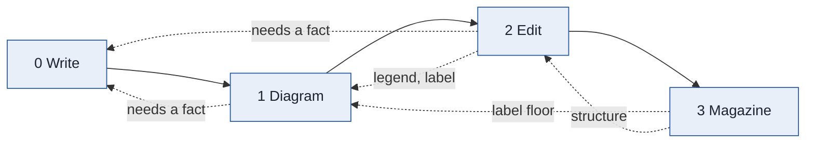

# Publish

A design document reaches Edward finished through four stages, and each stage is a skill that
already exists. This skill is the order, the gates, and the return channel between them. It
owns no judgement of its own: the judgement lives in the stage skills and their personas.



Solid arrows are the order. Dotted arrows are tickets: a finding sent back to the stage that
owns it. Tickets only ever go backwards.

## The stages, and what each may touch

| Stage | Skill | Touches | Gate | Never touches |
| --- | --- | --- | --- | --- |
| 0 write | the author (`/design`, or whoever wrote it) | anything: it is the author | none mechanical; the later gates judge it | — |
| 1 diagram | [[diagram]] | fences; a legend sentence beside a figure | `audit.py check` ≥ 7pt, `diff` IDENTICAL | prose beyond a legend; tables |
| 2 edit | [[edit]] | prose; a table cell only under declaration | `prose_audit.py diff` KEPT, no `[causal]`; the cold reader's list 1 empty | fences; headings; section order |
| 3 magazine | [[magazine]] | the edition file only | fidelity: every source line present; every plate ≥ 7pt; no page mostly white | the source, ever |

Diagrams go first because a redraw moves detail out of labels *into* the prose; the editor
should see that prose. The magazine goes last because it renders whatever the source is, and
proves it changed nothing on the way.

## Tickets: sending a finding back

A stage does not fix what it does not own. It writes a ticket:

```
<from-stage> -> <to-stage>: <what>  (<where>)
```

- **Any stage → 0 write** when the fix needs a fact the document does not carry: an undefined
  term, a reference with no antecedent, a count that does not add up, a "which of the three is
  still valid" the text never says, a claim the figure and the prose make differently. The
  author answers from the code and the other documents, never from guesswork, and writes the
  answer into the document in as few words as the fact needs. **Edward is not the author of
  most of these documents and has not read them; a ticket to stage 0 goes to the author agent,
  not to him.**
- **2 edit → 1 diagram** when the prose beside a figure and the figure disagree after an edit
  (a legend that names four verdicts where the edge label names two), or when a figure's label
  carries something the prose should.
- **3 magazine → 1 diagram** when a plate's labels print under the floor at every placement:
  fewer nodes per rank or shorter labels, which is the author's call, not the builder's.
- **3 magazine → 2 edit** when the page has a hole the layout cannot close because of the
  source's structure (four plates in a row with a sentence between) — the editor decides whether
  a sentence can move; if the structure is the author's, on to stage 0.
- **1 diagram → 0 write** when a figure is `needs-author`: six participants, a 37-node graph,
  a diagram that cannot be split without a fact about what the boundary is.

**Bounds.** A ticket to a stage re-runs that stage and every stage after it. Each stage may be
returned to **at most twice per publish**; the third finding of the same kind is parked in the
report as an open question, and the document ships with it named. A parked question is never
silently dropped and never a reason to stop: the edition goes out with the question in the
report, the way the diagram skill ships a figure that fell short with the figure named.

## The board

`scripts/publish.py board <doc.md> [--before <before.md>] [--kind …]` runs every stage's
mechanical gate and prints one line per stage — green or red — and every ticket the gates alone
can raise, each with its destination. Exit 0 is green across the board. It does the mechanical
half; the judgement half (the cold reader's meaning list, the art director's eye, the author's
answers) comes from the agents and lands as tickets in the same shape, by hand.

```
publish board: docs/design/execution-broker.md
  [green] diagram   30 figure(s), 0 blocker(s), audit exit 1
  [RED  ] edit      10627 words, 15.5 words/sentence, 9% over 30, cost 9.7 | gate: KEPT
  [green] magazine  kind: feature — 14113 words, 30 figures | fidelity ok
  1 ticket(s):
    edit -> edit: 61-word sentence (line 1494)
```

A red line with no ticket to an earlier stage is that stage's own work. A ticket to `write` is
the one a human cannot answer for the author.

## Working one document

1. **Board it first**: `publish.py board <doc>`, with `--before` set to the committed file. Read
   the tickets. Copy the file to scratch as the before of each stage.
2. **Stage 1, diagram**: run the diagram skill over the document. Its tickets to stage 0 go into
   the author's queue; do not start stage 2 until the author has answered and the figures pass.
3. **Stage 2, edit**: the edit skill — author, gate, cold reader, fixes — in rounds until the
   reader's list 1 is empty and list 2 holds only parked questions. Its tickets to stage 0 and 1
   are answered before stage 3.
4. **Stage 3, magazine**: build, print, look at every page. Its tickets to 1 and 2 are answered,
   then it is rebuilt.
5. **Board again**: green, or every red line has a parked question with a name.
6. **Commit**: one branch per document, one commit per stage (the diff is the review), merged
   when the board is green; the print edition rebuilt in the last commit. Every commit
   path-scoped to the document and its edition.
7. **Report**: the board's last output; the tickets raised and where each went; the parked
   questions; the stage measures before and after (figures under the floor, cost and long
   sentences, pages). Ten lines.

## Working a tree

Rank by the edit skill's `audit` (cost) and the diagram skill's `audit` (blockers), publish in
ranked order, one document per branch, and checkpoint the queue position to disk so stopping
costs only what is in flight. A batch is overnight-shaped: an author, an editor and a reader per
document, three documents at a time.

**Do not propose a tree run.** Edward declined it twice on 2026-09-20: *"It's a lot of tokens to
spend on documents that I'm not sure I'll read."* A document is published when he is about to
read it, one at a time, on his word — never because it exists.

## Restraint

- **No stage does another stage's work**, however small the fix looks. An editor who redraws an
  edge label or a diagram author who rewrites a paragraph has broken the gate that would have
  caught the mistake.
- **No stage invents.** A ticket to the author is the answer to "this needs a fact" — never a
  guess by the stage that found the gap.
- **The magazine is the last word on what the reader sees.** The final look at rendered pages is
  taken, not skipped, whatever the board says; every substantive defect in the magazine skill's
  history was found by looking at pages.

## Which model this needs

The board is code. Stages 1–3 carry their own model guidance; the author (stage 0) is Fable or
Opus, and never the same instance as the cold reader that raised the ticket. A cheap model may
run the board and report.

## Where it came from

Built 2026-09-20, the day the three stage skills were run by hand over three maestro design
documents. Edward's question that evening — *"how is this gonna work in practice? Is it a three
step process? … it would really be four steps because the original agent needs to write out its
original document"* — and his addition: *"maybe each step should include the ability to send back
to the previous step if it finds issues, too."* The tickets are that.
